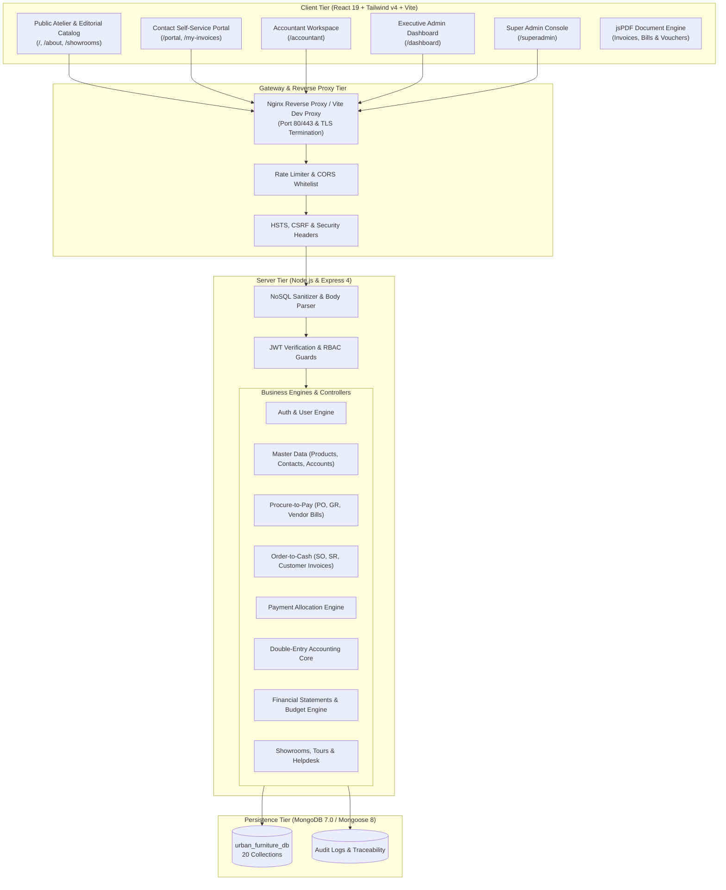

# 🏢 Urban Furniture ERP & Atelier Web Suite
### *Odoo Hackathon Finale — Enterprise Double-Entry Accounting & Artisanal ERP Platform*

<div align="center">

[-brightgreen?style=for-the-badge&logo=checkmarx)](tests.md)
[-teal?style=for-the-badge&logo=cashapp)](#-double-entry-accounting-engine--invariants)
[](#-qa-audit-test-suite--data-integrity)
[](#-security-compliance--session-protection)
[-purple?style=for-the-badge&logo=vite)](#)

<p align="center">
  <b>A unified luxury atelier showcase, multi-channel procurement & sales ERP, and mathematically verified double-entry accounting engine.</b>
</p>

[✨ Live Features](#-core-capabilities--functional-modules) •
[📐 Architecture](#-system-architecture) •
[🚀 Quick Start](#-getting-started--installation) •
[🔐 Demo Credentials](#-demo-accounts--credentials) •
[📑 API Reference](#-api-endpoints-reference) •
[🧪 QA & Tests](tests.md)

</div>

---

## 📖 Executive Overview

**Urban Furniture ERP & Atelier Web Suite** is a full-stack enterprise resource planning and financial accounting platform architected for high-end luxury furniture design, manufacturing, and commerce. Built as a comprehensive solution for the **Odoo Hackathon Finale**, the system bridges the gap between high-touch aesthetic client experiences and back-office financial rigor.

Unlike generic CRUD management tools, Urban Furniture ERP enforces a **strict double-entry general ledger engine** directly in the backend core. Every physical warehouse movement, customer order confirmation, vendor delivery receipt, and payment settlement automatically posts balanced, immutable journal entries (`Debit == Credit`), ensuring auditability, compliance, and real-time financial reporting (Balance Sheet, Profit & Loss, and Departmental Budget Variance).

---

## 🌟 Key Highlights & Architectural Differentiators

### 1. ⚖️ Mathematically Invariant Double-Entry Accounting Engine
* **Universal Balanced Ledger:** Total Debits must equal Total Credits across all journal lines within an exact `0.001` floating-point tolerance before posting.
* **Normal Balance Signs:** Enforces standard financial rules (Assets & Expenses increase via Debit; Liabilities, Equity, and Income increase via Credit).
* **Automated Document Posting:** Posting Vendor Bills and Customer Invoices dynamically generates multi-leg balanced journal entries mapped to specific Chart of Accounts (Purchases Expense, Creditors, Debtors, Sales Income, Tax Payable).
* **Zero-Delta Reversals:** Cancellation of posted entries executes an exact reverse ledger impact, netting accounts back to original balances.
* **Idempotent Posting Locks:** Prevents duplicate journal entries on re-submissions.

### 2. 🛡️ 100% Database Mutational Safety & Negative Testing
* **Zero DB Mutations on Rejection:** All 17 negative validation scenarios (malformed inputs, negative quantities/prices, missing foreign keys, unauthorized roles, overpayments) were audited with pre- and post-execution MongoDB collection counts: **0 corrupt or orphaned records are ever written.**
* **Arithmetic Integrity Guards:** Line-item price calculations (`qty * unitPrice == totalPrice`) and total amount sums are validated on the server.

### 3. 👥 Five Distinct Role-Based Portals & Experiences
The application dynamically routes users based on their JWT authorization and security role:
1. **👑 Super Admin Portal (`/superadmin`):** Multi-organization management, subscription tracking, user management, system activity feed, real-time memory and uptime telemetry, and full audit logging (`AuditLog`).
2. **💼 Executive Admin Dashboard (`/dashboard`):** High-level financial KPIs, Gross & Net Profit/Loss analysis, sales vs. purchase comparisons, budget snapshot cards, top-selling products, and Concierge lead processing.
3. **📊 Accountant Workspace (`/accountant`):** Double-entry accounting center, Chart of Accounts, Journal Entries posting/cancellation, Goods Receipts & Sales Receipts validation, Vendor Bills & Customer Invoices, Payment allocation engine, Budget monitoring, and instant client-side PDF document exports.
4. **🤝 Customer / Vendor Self-Service Portal (`/portal`, `/my-invoices`):** Self-service portal for trade partners, customers, and vendors to review assigned invoices, download billing statements, submit payments, track order receipts, and raise support tickets.
5. **🏛️ Public Atelier & Editorial Showcase (`/`, `/about`, `/showrooms`, `/partner-helpdesk`):** High-fashion editorial catalog, interactive luxury living space showcases, multi-city showroom tour booking, designer trade program application, and helpdesk support ticketing.

### 4. 🔒 Enterprise Security & Session Protection
* **Inactivity Auto-Logout Modal:** Idle session detector with visual countdown modal protecting sensitive financial workstations.
* **Anti-CSRF & Origin Protection:** Custom headers and origin whitelisting guarding mutating state endpoints.
* **NoSQL Injection Sanitizer:** Strips malicious MongoDB operators (`$gt`, `$ne`, `$where`) and prototype pollution vectors from incoming request bodies.
* **Public Role Hardening:** Self-registration endpoint restricts privilege escalation by disallowing direct assignment of elevated roles (`admin`/`superadmin`).
* **Rate Limiting & Security Headers:** `express-rate-limit`, HSTS, reverse proxy headers (`X-Forwarded-For`), and sensitive endpoint cache-control (`no-store`).

---

## 📐 System Architecture



---

## 🛠️ Technology Stack

| Layer | Technologies | Key Highlights |
| :--- | :--- | :--- |
| **Frontend UI** | React 19, Vite 8, Tailwind CSS v4 | Ultra-fast SPA with zero CSS bloat, responsive luxury layout, custom smooth scrollbars. |
| **Animation & UX** | Framer Motion 13, Lucide React Icons | Smooth transitions, stagger effects, interactive modals, and tactile controls. |
| **Document Generation** | jsPDF 4, jsPDF-AutoTable 5 | Instant client-side generation of professional PDF invoices, vendor bills, and payment vouchers. |
| **Backend API** | Node.js (v18+), Express 4.21 | Modular REST architecture with clean separation of routes, controllers, middleware, and models. |
| **Database & ORM** | MongoDB 7.0, Mongoose 8.9 | 20 schema-enforced collections with custom validators, indexes, and pre-save hooks. |
| **Security & Auth** | JWT (`jsonwebtoken`), BcryptJS, Express-Rate-Limit | Salted password hashing, stateless Bearer tokens, granular RBAC, and rate throttling. |
| **Testing Suite** | Native Node.js Test Harness, Assertions | 87 automated integration tests validating positive, negative, and edge scenarios. |
| **DevOps & Deploy** | Docker, Docker Compose, Nginx | Multi-container setup with SSL reverse proxy, health checks, and restart policies. |

---

## 📦 Core Capabilities & Functional Modules

### 1. 🗂️ Master Data & Configuration
* **Chart of Accounts (COA):** Standard 4-digit code chart classified into Assets (`1xxx`), Liabilities (`2xxx`), Equity (`3xxx`), Revenue/Income (`4xxx`), and Cost/Expenses (`5xxx`).
* **Journals Management:** Dedicated journals for Customer Invoices (`INV`), Vendor Bills (`BILL`), Bank Operations (`BNK`), Cash Transactions (`CSH`), and General Miscellaneous (`MISC`).
* **Products Catalog:** Multi-category furniture assets (Living Room, Dining, Bedroom, Executive Office, Outdoor) with SKU, dimensions, material tags, stock valuation, and tax percentages.
* **Contacts Directory:** Centralized address book categorizing entities into Customers, Vendors, Contractors, and Trade Partners with tax IDs and credit terms.
* **Analytic Accounts & Cost Centers:** Departmental tracking for Interior Projects, Showroom Operations, Retail Sales, and Manufacturing.

### 2. 🚚 Procure-to-Pay (P2P) Lifecycle
```text
Purchase Order (PO) ➔ Goods Receipt (GR) ➔ Vendor Bill ➔ Post to Ledger ➔ Payment Allocation
```
* Create draft Purchase Orders with vendor quotation pricing and line items.
* Generate and receive Goods Receipts to verify physical delivery before billing.
* Convert received orders into Vendor Bills with invoice numbers and due dates.
* Automatic generation of balanced journal entries upon bill posting:
  * **Debit:** Purchases Expense (`5001`)
  * **Credit:** Accounts Payable / Creditors (`2001`)
* Settle bills partially or in full via Bank or Cash with payment vouchers.

### 3. 🛍️ Order-to-Cash (O2C) Lifecycle
```text
Sales Order (SO) ➔ Sales Receipt (SR) ➔ Customer Invoice ➔ Post to Ledger ➔ Payment Settlement
```
* Draft and confirm customer Sales Orders with delivery terms and line-item tax calculations.
* Validate Sales Receipts confirming warehouse dispatch and fulfillment.
* Issue Customer Invoices with automated ledger entries:
  * **Debit:** Accounts Receivable / Debtors (`1002`)
  * **Credit:** Sales Income (`4001`)
  * **Credit:** Tax / VAT Payable (`2002`)
* Accept customer payments (partial or full) with overpayment prevention guards.

### 4. 📑 Financial Reporting & Budget Telemetry
* **Profit & Loss Statement (P&L):** Dynamic computation of Operating Revenue, Cost of Goods Sold (COGS), Gross Profit, Operating Expenses, and Net Profit/Loss.
* **Balance Sheet:** Real-time asset-liability verification confirming that `Assets == Liabilities + Equity`.
* **Departmental Budget Variance:** Planned vs. actual expenditure monitoring across analytic accounts with variance percentage and burn rates.
* **General Ledger & Journal Audit:** Filterable, paginated audit log of all debit/credit journal items with origin document links.

### 5. 🛋️ Concierge & Atelier Lead Management
* **Showroom Locator & Tour Booking:** Interactive showroom directory (Milan, Paris, Tokyo, New York, London, Dubai) with VIP tour scheduling.
* **Designer & Architect Inquiries:** Private trade program inquiry submission and qualification workflow.
* **Partner Helpdesk:** Support ticketing system with severity classification (`Low`, `Medium`, `High`, `Urgent`) and status resolution tracking.

---

## 🔐 Demo Accounts & Credentials

The database includes pre-seeded accounts configured with distinct roles and credentials:

| Role | Email Address | Password | Permissions & Intended View |
| :--- | :--- | :--- | :--- |
| **Super Admin** | `superadmin@urbanfurniture.com` | `SuperAdmin123!` | Full multi-tenant control, user management, audit logs, system telemetry (`/superadmin`) |
| **Admin** | `admin@urbanfurniture.com` | `AdminPassword123!` | Executive dashboard, financial oversight, concierge lead management, user invites (`/dashboard`) |
| **Accountant** | `accountant@urbanfurniture.com` | `AccountantPassword123!` | Complete accounting operations, invoice/bill posting, payments, reports, PDF exports (`/accountant`) |
| **Contact** | `contact@urbanfurniture.com` | `ContactPassword123!` | Customer/Vendor self-service portal, view assigned invoices, receipts, and submit payments (`/portal`) |

---

## 🚀 Getting Started & Installation

### Prerequisites
* **Node.js:** v18.0.0 or higher
* **npm:** v9.0.0 or higher
* **MongoDB:** v6.0+ running locally on `mongodb://127.0.0.1:27017` (or MongoDB Atlas connection string)
* *(Optional)* **Docker & Docker Compose**

---

### Method A: Local Development Setup (Recommended)

#### 1. Clone the Repository
```bash
git clone https://github.com/hirakkudecha-coder/Odoo_Hackathon_Finale.git
cd Odoo_Hackathon_Finale
```

#### 2. Configure and Start the Backend Server
```bash
cd server

# Install backend dependencies
npm install

# Create environment configuration file
cp .env.example .env

# (Optional) Verify .env settings:
# PORT=5000
# MONGO_URI=mongodb://127.0.0.1:27017/urban_furniture_db
# JWT_SECRET=urban_furniture_super_secret_jwt_key_2026
# CORS_ORIGIN=http://localhost:5173

# Seed the database with comprehensive demo data (20 collections)
npm run seed

# Start the Express server in development mode
npm run dev
```
> The backend server will start on: **`http://localhost:5000`**  
> Health check endpoint: `http://localhost:5000/api/health`

#### 3. Configure and Start the Frontend Client
In a new terminal window:
```bash
cd client

# Install frontend dependencies
npm install

# Start the Vite development server
npm run dev
```
> The React application will be available at: **`http://localhost:5173`**  
> Vite automatically proxies all `/api` requests to `http://localhost:5000`.

---

### Method B: Docker Compose Deployment

To deploy the entire multi-tier stack (Nginx + Express Backend + MongoDB) with a single command:

```bash
cd server
docker-compose up --build -d
```

Containers launched:
* `urban_furniture_reverse_proxy` (Nginx Gateway on Ports `80` & `443`)
* `urban_furniture_backend` (Express API on Port `5000`)
* `urban_furniture_db` (MongoDB 7.0 on Port `27017`)

To stop the containers:
```bash
docker-compose down
```

---

## 🧪 QA Audit, Test Suite & Data Integrity

The project incorporates an automated end-to-end integration and negative test suite that verifies all backend endpoints, mathematical invariants, and database safety guarantees.

### Running the Test Suite
Ensure MongoDB is running and execute:
```bash
cd server
npm test
```

### 📊 Quality Scorecard (from [`tests.md`](tests.md))

```text
================================================================================
       URBAN FURNITURE ERP — AUTOMATED TEST SUITE EXECUTION REPORT
================================================================================
Total Verified Scenarios : 87 / 87 (100% PASS)
Negative Validation Tests: 17 Cases (0 Corrupt / Orphaned DB Records)
Double-Entry Tolerance   : Balanced within 0.001 Floating-Point Tolerance
Frontend Build Status    : Vite build exits Code 0 (711ms)
================================================================================
```

| Category | Scenarios | Status | Key Validations |
| :--- | :---: | :---: | :--- |
| **System Health & Telemetry** | 2 / 2 | `✅ PASS` | Fast public `/health` and live `/heartbeat` telemetry (uptime, RSS/heap memory, DB state). |
| **Auth & Security** | 7 / 7 | `✅ PASS` | Password hashing, duplicate checks, JWT issue/validation, protected profile retrieval. |
| **RBAC Route Authorization** | 5 / 5 | `✅ PASS` | Enforces permissions across `admin`, `accountant`, and `contact` roles with `403 Forbidden`. |
| **Master Data Validation** | 11 / 11 | `✅ PASS` | Strict schema enums, negative price rejections, and unique account code constraints. |
| **Goods Receipts Lifecycle** | 9 / 9 | `✅ PASS` | Line-item arithmetic verification (`qty * unitPrice == total`), confirmation state transitions. |
| **Sales Receipts Lifecycle** | 9 / 9 | `✅ PASS` | Customer billing accuracy, delivery state transitions, and duplicate confirm locks. |
| **Double-Entry Engine** | 5 / 5 | `✅ PASS` | Minimum 2 items per entry, `Debit == Credit` validation, and zero-sum cancellation reversal. |
| **Auto-Posting Invoicing** | 5 / 5 | `✅ PASS` | Automated multi-leg journal entry generation for Vendor Bills and Customer Invoices. |
| **Payments & Settlements** | 6 / 6 | `✅ PASS` | Partial/full bill settlement, customer cash clearing, and overpayment rejections. |
| **Financial Statements** | 3 / 3 | `✅ PASS` | Dynamic real-time calculation of Profit & Loss, Balance Sheet, and Budget Variance. |
| **Concierge & Atelier APIs** | 11 / 11 | `✅ PASS` | Showroom tour bookings, designer trade inquiries, and helpdesk ticketing workflows. |
| **Frontend Merge Resolutions**| 10 / 10 | `✅ PASS` | 10 data table components verified for live API fetching, sorting, filtering, and PDF exports. |
| **Full-Page Module Routes** | 4 / 4 | `✅ PASS` | Zero-breakage client routing for Showrooms, About, Helpdesk, and Budget pages. |

---

## 📑 API Endpoints Reference

Base URL: `http://localhost:5000/api`

### 1. Health & Telemetry
* `GET /health` — Fast public server status check
* `GET /health/heartbeat` — System uptime, memory allocation, and database connectivity metrics

### 2. Authentication & Users
* `POST /auth/register` — Register new user account (public role defaults to `accountant`)
* `POST /auth/login` — Authenticate credentials and receive Bearer JWT token
* `GET /auth/me` — Retrieve authenticated user profile *(Protected)*
* `GET /auth/users` — List system users *(Admin / Super Admin)*
* `POST /auth/users` — Provision new user with explicit role *(Admin / Super Admin)*

### 3. Master Data
* `GET|POST /contacts` — List or create contacts (Customers, Vendors, Partners)
* `GET|PUT|DELETE /contacts/:id` — Retrieve, update, or remove contact records
* `GET|POST /products` — List or create catalog products with inventory prices
* `GET|POST /accounts` — List or create Chart of Accounts (`Asset`, `Liability`, `Equity`, etc.)
* `GET|POST /journals` — List or create operational journals (`sale`, `purchase`, `cash`, `bank`)
* `GET|POST /analytic-accounts` — Manage cost centers and departmental tracking units

### 4. Procurement & Purchases
* `GET|POST /purchase-orders` — List or draft purchase orders
* `GET|POST /goods-receipts` — Manage goods receipt notes from suppliers
* `POST /goods-receipts/:id/confirm` — Confirm warehouse delivery and update status
* `GET|POST /vendor-bills` — Manage supplier vendor bills
* `POST /vendor-bills/:id/post` — Post vendor bill to ledger (auto-generates balanced Journal Entry)

### 5. Sales & Orders
* `GET|POST /sales-orders` — List or create customer sales quotations and orders
* `GET|POST /sales-receipts` — Warehouse dispatch receipts
* `POST /sales-receipts/:id/confirm` — Confirm goods delivery to customer
* `GET|POST /customer-invoices` — List or create customer sales invoices
* `POST /customer-invoices/:id/post` — Post customer invoice to ledger (auto-generates balanced Journal Entry)

### 6. Accounting & Ledgers
* `GET|POST /journal-entries` — Query general ledger or create manual journal entry
* `POST /journal-entries/:id/post` — Validate `Debit == Credit` and post entry to accounts
* `POST /journal-entries/:id/cancel` — Cancel posted entry and execute reverse balancing impact
* `GET|POST /payments` — Register customer payment receipt or vendor disbursement
* `GET /reports/profit-loss` — Dynamic Profit & Loss statement calculation
* `GET /reports/balance-sheet` — Real-time Balance Sheet equation audit
* `GET /reports/budget` — Departmental budget variance and telemetry report

### 7. Concierge & Support
* `GET /showrooms` — List physical brand showrooms across major cities
* `POST /showrooms/book-tour` — Book a VIP private showroom viewing
* `POST /inquiries/designer` — Submit custom interior designer / architectural inquiry
* `GET|POST /helpdesk/tickets` — Submit and query customer service & trade tickets
* `GET /audit-logs` — Query timestamped administrative action log *(Super Admin)*

---

## 📁 Repository Structure

```text
Odoo_Hackathon_Finale/
├── client/                         # React 19 Frontend Application
│   ├── public/                     # Static assets and favicons
│   ├── src/
│   │   ├── assets/                 # Brand imagery and design graphics
│   │   ├── components/
│   │   │   ├── accountant/         # Accountant Workspace & General Ledger tables
│   │   │   ├── admin/              # Executive Admin Dashboard & Concierge modules
│   │   │   ├── animations/         # Framer Motion entrance & interaction presets
│   │   │   ├── auth/               # Login, Register, Forgot Password & MFA modals
│   │   │   ├── common/             # Navbar, Footer, InactivityModal, Showrooms, About
│   │   │   ├── portal/             # Customer & Vendor Self-Service Portal
│   │   │   ├── sections/           # Editorial Landing Page long-form content sections
│   │   │   └── superadmin/         # Super Admin Console & Audit Log viewers
│   │   ├── hooks/                  # Custom hooks (useApi, useInactivityTimeout, etc.)
│   │   ├── utils/                  # jsPDF document generators (Invoices, Bills, Receipts)
│   │   ├── App.jsx                 # Client-side router, role dispatch & state container
│   │   ├── index.css               # Tailwind CSS v4 design tokens & typography rules
│   │   └── main.jsx                # React DOM entrypoint
│   ├── package.json                # Client dependencies and build scripts
│   └── vite.config.js              # Vite bundler configuration & /api reverse proxy
│
├── server/                         # Node.js & Express 4 Backend API
│   ├── nginx/                      # Nginx reverse proxy configuration for Docker
│   ├── src/
│   │   ├── config/                 # Database connection & environment loaders
│   │   ├── controllers/            # Request handlers for all 20 business domains
│   │   ├── middleware/             # Auth, RBAC, CSRF, NoSQL sanitizers, error handlers
│   │   ├── models/                 # 20 Mongoose schemas with validation & pre-save hooks
│   │   ├── routes/                 # Express API router declarations
│   │   ├── seed/                   # Comprehensive mock database seeder (seedData.js)
│   │   ├── services/               # Business logic, calculations & ledger posting
│   │   ├── utils/                  # Helper utilities and token generators
│   │   └── app.js                  # Express app setup, CORS, and route mounting
│   ├── ssl/                        # Local TLS certificate stubs
│   ├── test/                       # Automated integration & negative test runner
│   ├── .env.example                # Sample environment configuration
│   ├── API_CONTRACT_DOCS.md        # Detailed backend API contract specification
│   ├── docker-compose.yml          # Container orchestration (Nginx, Express, MongoDB)
│   ├── Dockerfile                  # Production container recipe for backend
│   ├── package.json                # Backend dependencies and scripts
│   └── server.js                   # Application entrypoint & HTTP server listener
│
├── tests.md                        # Complete 87-scenario QA audit report & execution proof
└── README.md                       # Master project documentation
```

---

## 👥 Hackathon Team & Engineering Credits

Developed with passion for the **Odoo Hackathon Finale**:

* **Student 1 (Backend Engineering & Architecture):** Double-entry accounting engine, Mongoose data models, Express REST controllers, transactional immutability, and security middleware.
* **Student 2 (Frontend Architecture & Business Logic):** React SPA client, state synchronization, data tables, filter mechanics, and jsPDF integration.
* **Student 3 (UI/UX Design & Luxury Atelier Styling):** Editorial layout design, Tailwind CSS styling tokens, typographic hierarchy, Framer Motion transitions, and brand identity.
* **Student 4 (QA, Security & Integration):** Automated 87-scenario test harness, negative testing verification, git merge conflict resolution, and QA audit documentation.

---

<div align="center">

**Urban Furniture ERP & Atelier Web Suite**  
*Precision Financial Accounting Crafted for Luxury Living*  
Built for the Odoo Hackathon Finale 2026

</div>
